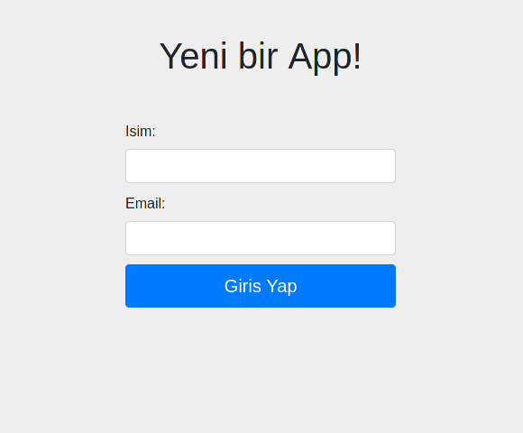
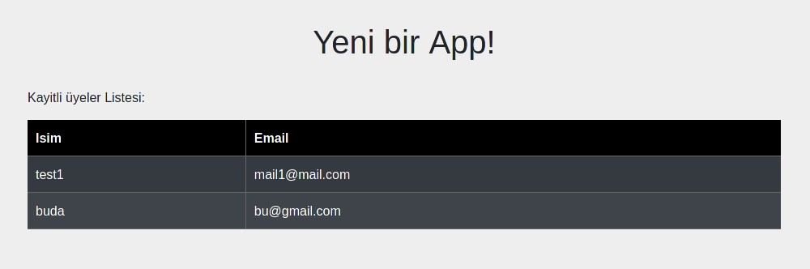

<h1 align="center">NodeJS MongoDB ile Kayit Sistemi</h1>

<div align="center">
  <strong>Egitim amacli yapimi kolay bir Veritabani Kayit Sistemi örnegi!</strong>
</div>

<br />

<div align="center">
  
  <a href="https://github.com/Saizzou/NodeJS_Kayit_Veritabaniy/graphs/contributors"></a>
  
  
</div>

<br />

# Yükleme
Yükleme islemi yada kendiniz tekrar yazabilmeniz icin gereksinimleri tamamlayiniz:

## Temel Gereksinimler:

1- Node! (Cok bariz bir bilgi)

2- Npm!

3- MongoDB

4- MongoDB-Compass (opsiyonel tabii)

## NPM yüklemeleri:

1- npm install express

2- npm install --save-dev nodemon

3- npm install pug

4- npm install body-parser (SADECE EXPRESS < = V3 ) 

5- npm install express-validator

6- npm install dotenv

7- npm install mongoose

8- npm install http-auth

## Digerleri:

1- Daha güzel htaccess sifreleri icin : https://hostingcanada.org/htpasswd-generator/

2- Bootstrap : https://getbootstrap.com/docs/4.4/getting-started/download/

## Baslangic
Projeyi init etmeyi unutmayiniz:

``` $ npm init -y```

### Projeyi calistirma ve inceleme:

Projeyi calistirmak icin :
``` npm run proje```

Hata almadiginizdan emin olduktan sonra : http://localhost:3000 üstünde Kayitlari yapabilirsiniz.


Kayitlari incelemek icin : http://localhost:3000/registrations addressine gidin. 


### Giris
Giris sifresini degistirmezseniz standart giris ve sifre bilgisi:

Kullanici Adi: saizzou

Kullanici Sifresi : test12345

### HTACCESS Bilgilendirme
Projedeki users.htpasswd icerigini degistirin bunu sifreleyip yapmanizi tavsiye ederim. Kolay bir MD5 sifrelemesi icin : 
https://hostingcanada.org/htpasswd-generator/

# Projeyi yayinlayacaksaniz dikkat!
Bulunan users.htpasswd dosyasi iceriginin izinlerini degistirin! 755 izinini 644 olarak degistirmenizi tavsiye ederim!
